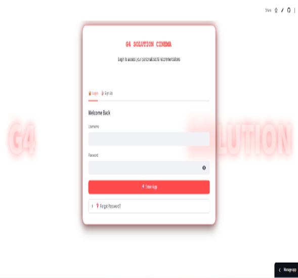
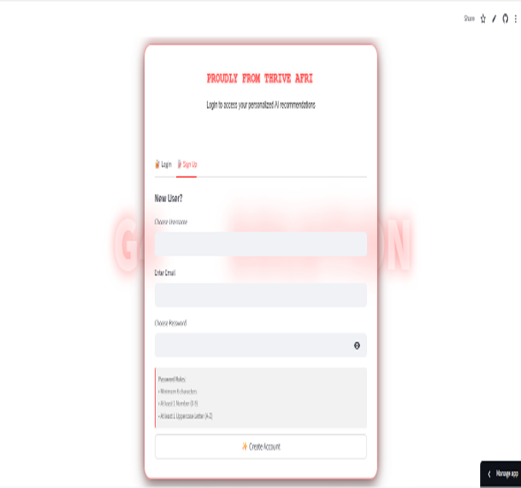
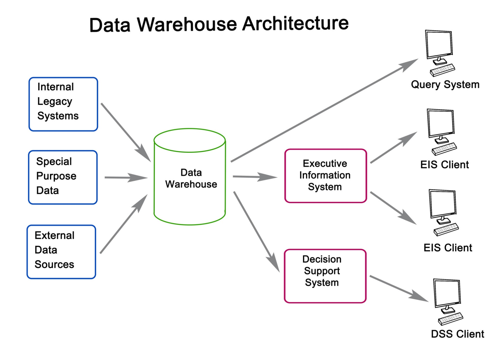

***G4 SOLUTION***: AI Movie Recommender System

**🎬 Project Description**
G4 SOLUTION is an advanced AI-powered movie recommendation engine developed to help users discover content tailored to their specific tastes. By leveraging a Hybrid Recommendation Approach, the system combines the strengths of Content-Based Filtering and Collaborative Filtering to provide accurate, diverse, and personalized movie suggestions.

**APP UI**
**Authentication Screens**

  
   

The project is deployed as an interactive web application using Streamlit, featuring secure user authentication, historical tracking, and deep movie insights including embedded trailers.

🚀 Key Features
🧠 Recommendation Engines
Content-Based Filtering: Recommends movies by analyzing metadata (plot overviews, genres, keywords, cast, and crew). If you like Avatar, the system analyzes its tags to find similar sci-fi/adventure movies.

Collaborative Filtering: Analyzes user rating patterns to find similarities between movies based on user preferences. It suggests movies that similar users have rated highly.

🔐 User Management & Security
Secure Authentication: Registration and Login system with hashed passwords (SHA256).

Password Reset: "Forgot Password" functionality utilizing email-based OTP (One-Time Password) verification.

Account Management: Options to clear history or permanently delete accounts.

💻 Interactive User Interface
Movie Details: View high-quality posters, detailed overviews, and genres.

Embedded Trailers: Watch YouTube trailers directly within the recommendation cards without leaving the app.

Smart History: The app tracks your search history, allowing you to view previous recommendations and download them as text files.

Dark Mode: Toggle between light and dark themes for visual comfort.

External Links: Direct links to download or stream movies on platforms like Netflix, Fzmovies, and Nkiri.

🛠️ Technical Implementation
Data Processing (The Notebook)
The core logic resides in the Jupyter Notebook, which processes raw data into machine learning models:

Data Cleaning:

Datasets (tmdb_5000_movies, credits, ratings) are merged.

Custom functions convert() and convert3() parse stringified JSON columns (like Genres and Keywords).

fetch_director() extracts the director's name from the Crew column.

Feature Engineering:

A unified tags column is created by concatenating the Overview, Genres, Keywords, Top 3 Cast, and Director.

Text is preprocessed (lowercased, spaces removed) to ensure consistency (e.g., "SciFi" vs "Sci-Fi").

Vectorization & Similarity:

Content-Based: Uses CountVectorizer to convert the tags into 5000-dimensional vectors.

* **Collaborative:** Creates a User-Movie Pivot Table and transposes it.

* **Metric:** `cosine_similarity` is calculated for both engines to measure the angle between vectors, determining how similar two movies are.
🧰 Tech Stack
Core Python Libraries:

pandas & numpy (Data Manipulation)

scikit-learn (Machine Learning: CountVectorizer, Cosine Similarity)

ast (Data parsing)

pickle & gzip (Model serialization)

Web Application:

streamlit (Frontend Framework)

Youtube (API for fetching trailers)

smtplib (Email services for OTP)

hashlib (Security)

⚙️ Installation & Setup
Follow these steps to run the project locally.

1. Clone the Repository
Bash

git clone https://github.com/your-username/G4-Movie-Recommender.git
cd G4-Movie-Recommender
2. Set up Virtual Environment
Bash

python -m venv venv
source venv/bin/activate  # On macOS/Linux
venv\Scripts\activate     # On Windows
3. Install Dependencies
Bash

pip install -r requirements.txt
4. Data Setup (Crucial Step)
The Streamlit app requires pre-trained model files.

Ensure the raw CSV files (tmdb_5000_movies.csv, tmdb_5000_credits.csv, ratings.csv, movies.csv) are in the project folder.

Run the provided Jupyter Notebook (movie_recommender.ipynb) to process the data.

This will generate the following required files:

movie_dict.pkl

similarity.pkl.gz

collab_similarity.pkl.gz

collab_titles.pkl

5. Configure Email (For OTP)
To make the "Forgot Password" feature work, update the credentials in movie_recommend.py:

Python

# movie_recommend.py
SMTP_SERVER = "smtp.gmail.com"
SMTP_PORT = 587
SENDER_EMAIL = "your_email@gmail.com"  # Replace with your email
APP_PASSWORD = "your_app_password"     # Generate an App Password in Gmail settings
6. Run the App
Bash

streamlit run movie_recommend.py
📂 Data Sources
TMDB 5000 Movie Dataset: Metadata for content-based filtering (Plot, Cast, Crew).

MovieLens Dataset: User ratings used for training the collaborative filtering model.

👥 Team G4 SOLUTION
Proudly developed by Group 4 for the Thrive Africa Machine Learning & AI Course.

Mentor: Big Tamara

Team Members:

Peter Agyekum

Felicia I. Nduefuna

Olivia Mawufemor Attipoe

Donkor Promise Esi Rhoda

Osborn Tulasi

Onipayede John Kwaku

Peter Agyekum Boateng

Aning Jason

Maxwell Adu

Michael Nyarku

Yeboah Eldad

© 2025 G4 SOLUTION. All Rights Reserved.
